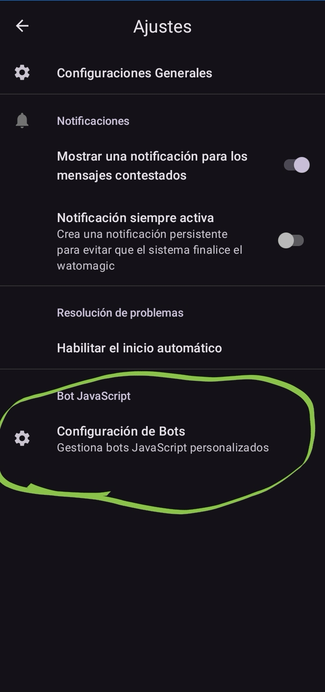
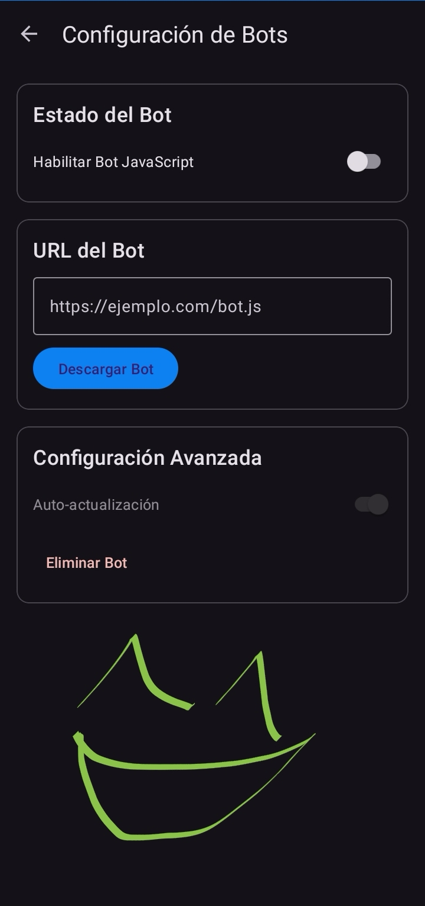

[Español](./README.md) · [English](./README_en.md)

# 🪄 Watomagic - Respuesta automática para apps de mensajería

Watomagic envía una respuesta automática a todos los que te contacten en apps de mensajería. Es especialmente útil si estás planeando migrar de estas apps, pero también podés usarlo como un contestador automático cuando estás de vacaciones.

### 📸 [Capturas de pantalla](./media/screenshots/)

| [][scr-page-link] | [][scr-page-link] |
|:---:|:---:|

[**❯ Ver más capturas**](./media/screenshots/)

---

## ✨ Características

- ✅ **Respuesta automática** en todas las apps de mensajería soportadas
- ✏️ **Personalizá tu mensaje** de respuesta automática
- 👥 **Funciona en grupos** también
- 🔒 **Respeto total por tu privacidad**
  - Sin análisis ni rastreo de datos
- 🆓 **Gratis y código abierto**

## 🧩 Plataforma BotJS ✅ **IMPLEMENTADO**

Sistema de bots JavaScript descargables que permite personalizar completamente la lógica de respuesta automática. **Completado en noviembre 2025**.

### Características implementadas:

- ✅ **Descarga segura** de `bot.js` desde HTTPS con validación SHA-256 opcional
- ✅ **Motor Rhino JavaScript** (ES5/ES6 parcial) con interoperabilidad Java↔JS completa y APIs controladas (`Android.log`, `Android.httpRequest`, storage)
- ✅ **GUI completa** - Pantalla Material 3 para configurar, probar y gestionar bots
- ✅ **Auto-updates** - WorkManager verificando nuevas versiones cada 6 horas
- ✅ **Seguridad robusta** - Timeout 5s, rate limiting (100 ejecuciones/min, 3 min entre descargas), validación de patrones peligrosos
- ✅ **Fallback automático** - Si el bot falla, usa respuesta estática/OpenAI

### Cómo usar:

1. Abrí la app y andá a **Configuración → Bot JavaScript**
2. Habilitá "Bot JS Enabled"
3. Ingresá la URL HTTPS de tu bot.js (opcional: hash SHA-256)
4. Click en "Download Bot"
5. Probá tu bot con el botón "Test Bot"
6. Configurá auto-updates si querés actualizaciones automáticas

### Documentación completa:

- [Guía de usuario](./docs/BOT_USER_GUIDE.md) — Cómo usar bots JavaScript
- [Guía de desarrollo](./docs/BOT_DEVELOPMENT_GUIDE.md) — Cómo crear tus propios bots
- [API Reference](./docs/BOT_API_REFERENCE.md) — APIs disponibles para bots
- [Arquitectura técnica](./docs/ARCHITECTURE.md) — Diseño del sistema

---

## 💡 ¿Para qué sirve?

Los cambios recientes en la política de privacidad de WhatsApp generaron una migración masiva hacia apps más respetuosas de la privacidad como Signal y otras. Pero la mayoría de nosotros encuentra difícil eliminar WhatsApp porque todo el mundo lo usa.

**Watomagic facilita tu migración** dejando que tus contactos sepan automáticamente que te mudaste a otra app. Simplemente configurá un mensaje de respuesta automática como *"Ya no uso WhatsApp. Por favor contactame por Signal…"* y dejá que la app haga el trabajo por vos.

> ⚠️ **Importante:** Esta app no está asociada con ninguna empresa, incluyendo WhatsApp, Facebook o Signal.

---

## 🔧 Solución de problemas

### La respuesta automática no funciona aunque Watomagic esté habilitado

Watomagic depende de las notificaciones para funcionar. La mayoría de los usuarios ya tiene las notificaciones habilitadas, así que debería funcionar de entrada. Si no funciona, asegurate de que:

- ✅ Las notificaciones estén habilitadas
- ✅ El bloqueo biométrico específico de la app esté deshabilitado para Watomagic

---

## ❓ Preguntas frecuentes

### ¿Por qué no usar una cuenta de WhatsApp Business para respuestas automáticas?

No podés usar una cuenta business sin aceptar la nueva política de privacidad que todos están tratando de evitar.

### ¿Estará disponible para iOS en el futuro?

Esta app depende de la función de respuestas rápidas desde notificaciones específica de Android. Esto probablemente no sea posible en iOS.

---

## 📚 Documentación y recursos

### Para usuarios:
- [Capturas de pantalla](./media/screenshots/) — Diseño de la app
- [Guía de usuario BotJS](./docs/BOT_USER_GUIDE.md) — Cómo configurar y usar bots

### Para desarrolladores:
- [CLAUDE.md](./CLAUDE.md) — Guía completa del proyecto para Claude Code
- [Guía de desarrollo de bots](./docs/BOT_DEVELOPMENT_GUIDE.md) — Crea tus propios bots JavaScript
- [API Reference](./docs/BOT_API_REFERENCE.md) — Documentación de APIs disponibles
- [Arquitectura del sistema](./docs/ARCHITECTURE.md) — Diseño técnico completo
- [CI/CD](./docs/GITHUB_ACTIONS_MIGRATION.md) — Builds firmados con GitHub Actions

---

[scr-page-link]: ./media/screenshots/
