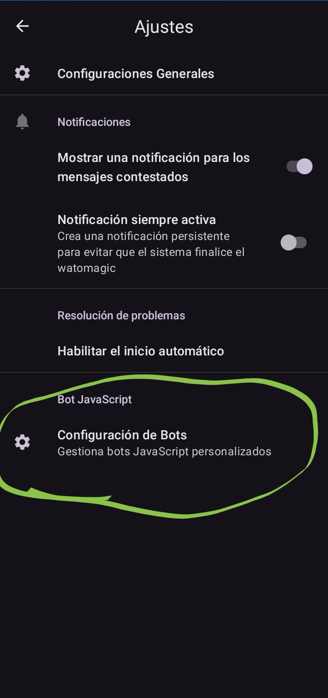

[❰ Volver al inicio](../../README.md)

# 📸 Capturas de pantalla | Watomagic

## Vista previa rápida

|  |  |  |
|:---:|:---:|:---:|

---

## 🎨 Modo claro y oscuro

### Pantalla principal

| Modo claro | Modo oscuro |
|:---:|:---:|
|  |  |
|  |  |

### Editor de mensajes

| Modo claro | Modo oscuro |
|:---:|:---:|
|  |  |
|  |  |

---

[❰ Volver al inicio](../../README.md)
